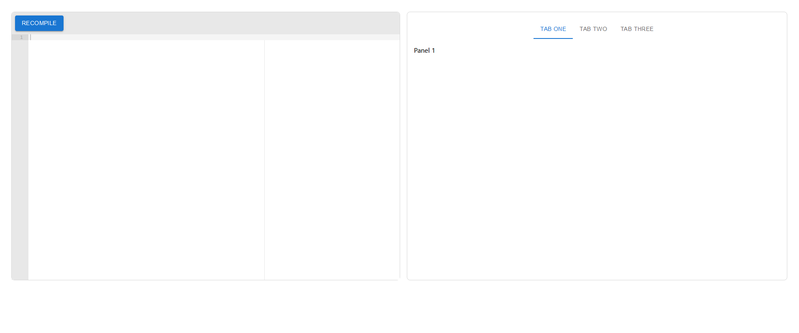

# Ace Editor + Tabs example

## Setup steps

- have Node.js and NPM installed (NPM usually comes with the install of Node)
- clone or download repository
- run `npm install` in root
- run `npm run dev` in root (for hot reloading)

## Used dependencies/libraries

- Material UI as styling library (https://mui.com/)
- React-Ace for the editor component (https://github.com/securingsincity/react-ace)
- Vite.js as the development and building tool around React
